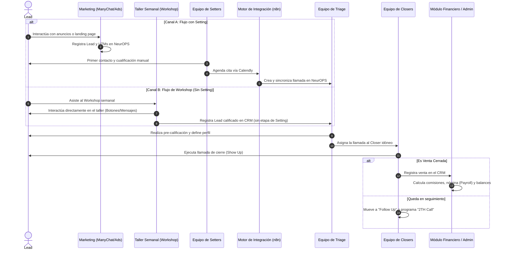

# Arquitectura y Funcionamiento del Proyecto - NeurOPS

NeurOPS es una plataforma integral de operaciones, CRM y automatización de marketing y ventas diseñada específicamente para gestionar el ciclo de vida de los leads y las transacciones de **Learnation**. Su objetivo principal es optimizar y medir la productividad de los equipos de captación (Setters y Workshops), calificación (Triage) y cierre de ventas (Closers).

---

## 1. Arquitectura Tecnológica General

El proyecto está diseñado bajo un modelo de **monolito híbrido**: el backend de Python/Flask funciona como una API RESTful centralizada que expone endpoints en formato JSON y, a su vez, sirve los archivos estáticos de la Single Page Application (SPA) en React en entornos de producción.

```mermaid
graph TD
    subgraph Frontend [Aplicación Cliente - React]
        UI[Interfaces de Usuario: Admin, Setter, Closer, Triage]
        AC[AuthContext & State]
        UI --> AC
    end

    subgraph Backend [Servidor API - Flask]
        init[App Factory: create_app]
        BP[Blueprints de la API: auth, marketing, closer, setter, workshop...]
        Serv[Capa de Servicios: booking, closer, marketing, sheets, database...]
        init --> BP
        BP --> Serv
    end

    subgraph Almacenamiento & Integraciones
        DB[(SQLAlchemy: SQLite / PostgreSQL)]
        GSheets[Google Sheets API]
        n8n[n8n (Automatizaciones / Webhooks)]
        Calendly[Calendly]
        Discord[Discord (Alertas/Notificaciones)]
        n8n <--> Calendly
    end

    UI <-->|Peticiones HTTP / JSON con Cookies| BP
    Serv <--> DB
    Serv <--> GSheets
    Serv <--> n8n
    n8n <--> Discord
```

### Backend (Monolito API)
- **Lenguaje**: Python 3.9+
- **Framework**: Flask, estructurado de forma modular con **Blueprints** en la carpeta [app/api](file:///c:/Users/EQUIPO%20DELL/Documents/GitHub/NeurOPS/app/api) para separar responsabilidades.
- **ORM**: SQLAlchemy via Flask-SQLAlchemy para la definición y consulta de base de datos relacional.
- **Migraciones**: Flask-Migrate (basado en Alembic) para gestionar versiones del esquema de base de datos.
- **Autenticación**: Flask-Login para el manejo de sesiones basadas en cookies seguras.
- **Seguridad**: CSRFProtect de Flask-WTF activo y validado estrictamente en todos los endpoints internos consumidos por la SPA (como `/api/closer`, `/api/setter`, etc.). El flujo interactúa de la siguiente forma:
    1. El frontend obtiene de forma diferida (lazy) el token CSRF consultando `GET /api/auth/csrf-token` al disparar la primera petición de mutación.
    2. La instancia centralizada de Axios ([api.js](file:///c:/Users/EQUIPO%20DELL/Documents/GitHub/NeurOPS/frontend/src/services/api.js)) intercepta de forma asíncrona todas las peticiones que no sean de lectura (`GET`, `HEAD`, `OPTIONS`) e inyecta dinámicamente el token CSRF obtenido en la cabecera `X-CSRFToken`.
    3. El backend valida de forma estricta la firma del token CSRF contrastándolo con la cookie de sesión del navegador.
    4. Adicionalmente, cuenta con trazabilidad integrada de auditoría: si un operador ejecuta acciones bajo suplantación de identidad (`is_impersonating`), los logs en `LeadEventLog` documentan al operador original actuando en nombre del usuario suplantado. Los endpoints externos consumidos por servidores y automatizaciones (webhooks de n8n, ManyChat, Google Calendar y Sheets) se mantienen exentos de la validación CSRF para garantizar la integración.
- **CORS**: Configurado en [app/\_\_init\_\_.py](file:///c:/Users/EQUIPO%20DELL/Documents/GitHub/NeurOPS/app/__init__.py) para permitir credenciales y controlar los orígenes permitidos durante el desarrollo local y de staging.

### Frontend (SPA)
- **Framework**: React 18+ estructurado en [frontend](file:///c:/Users/EQUIPO%20DELL/Documents/GitHub/NeurOPS/frontend).
- **Herramienta de Construcción**: Vite para compilación ultrarrápida.
- **Diseño y Estilos**: Tailwind CSS para un diseño ágil y responsivo, combinado con ShadcnUI para componentes interactivos de alta calidad.
- **Enrutamiento**: React Router DOM administrando las vistas de manera protegida en base al rol de usuario registrado ([App.jsx](file:///c:/Users/EQUIPO%20DELL/Documents/GitHub/NeurOPS/frontend/src/App.jsx)).
- **Gestión de Estado**: Contextos globales de React como `AuthContext` y hooks personalizados para llamadas API.

### Bases de Datos
- **Entorno Local**: SQLite (`instance/local.db`) para agilizar el desarrollo y pruebas unitarias.
- **Entorno Producción**: PostgreSQL para persistencia escalable y soporte de transacciones concurrentes.
- **Estrategias de Optimización de Rendimiento**:
  - **Indexación de Llaves Foráneas**: Se definieron índices explícitos (`index=True`) en tablas de alto crecimiento como `lead_event_logs` (`appointment_id`, `user_id`), `payments` (`enrollment_id`, `payment_method_id`) y `enrollments` (`client_id`, `program_id`, `closer_id`). Esto reduce la complejidad temporal de los JOINs frecuentes y filtros de reportes.
  - **Mitigación de Consultas N+1 en Serializadores**: Para evitar consultas recurrentes en listados (problema N+1), métodos de serialización como `FinancialAgenda.to_dict()` admiten parámetros de conteo precalculados en lote (`sales_count`). Las búsquedas individuales de fallback se optimizaron usando comparaciones indexadas de tipo `ilike`, erradicando el uso de funciones SQL sobre texto (`func.lower(...)`) que invalidan los índices.

---

## 2. Estructura del Repositorio

La distribución de archivos y carpetas clave del proyecto es la siguiente:

- **[app/](file:///c:/Users/EQUIPO%20DELL/Documents/GitHub/NeurOPS/app)**: Código fuente del backend.
  - **[__init__.py](file:///c:/Users/EQUIPO%20DELL/Documents/GitHub/NeurOPS/app/__init__.py)**: Factory de la aplicación, configuración de extensiones, CORS, middlewares y registro de Blueprints.
  - **[api/](file:///c:/Users/EQUIPO%20DELL/Documents/GitHub/NeurOPS/app/api)**: Blueprints que exponen los endpoints RESTful para cada rol o módulo de negocio (ej. [closer.py](file:///c:/Users/EQUIPO%20DELL/Documents/GitHub/NeurOPS/app/api/closer.py), [setter.py](file:///c:/Users/EQUIPO%20DELL/Documents/GitHub/NeurOPS/app/api/setter.py), [marketing.py](file:///c:/Users/EQUIPO%20DELL/Documents/GitHub/NeurOPS/app/api/marketing.py), [workshop.py](file:///c:/Users/EQUIPO%20DELL/Documents/GitHub/NeurOPS/app/api/workshop.py)).
  - **[models/](file:///c:/Users/EQUIPO%20DELL/Documents/GitHub/NeurOPS/app/models)**: Declaración de modelos SQLAlchemy estructurada por entidades (usuarios, clientes, campañas, reservas, finanzas, talleres).
  - **[services/](file:///c:/Users/EQUIPO%20DELL/Documents/GitHub/NeurOPS/app/services)**: Capa de lógica de negocio y servicios reutilizables (ej. [closer_service.py](file:///c:/Users/EQUIPO%20DELL/Documents/GitHub/NeurOPS/app/services/closer_service.py), [booking_service.py](file:///c:/Users/EQUIPO%20DELL/Documents/GitHub/NeurOPS/app/services/booking_service.py)).
- **[frontend/](file:///c:/Users/EQUIPO%20DELL/Documents/GitHub/NeurOPS/frontend)**: Código del cliente React.
  - **[src/App.jsx](file:///c:/Users/EQUIPO%20DELL/Documents/GitHub/NeurOPS/frontend/src/App.jsx)**: Enrutador principal y definición de rutas protegidas basadas en roles.
  - **[src/components/](file:///c:/Users/EQUIPO%20DELL/Documents/GitHub/NeurOPS/frontend/src/components)**: Componentes atómicos de UI y layouts estructurados.
  - **[src/pages/](file:///c:/Users/EQUIPO%20DELL/Documents/GitHub/NeurOPS/frontend/src/pages)**: Vistas del sistema organizadas por roles (`admin`, `setter`, `closer`, `operations`, `public`).
- **[migrations/](file:///c:/Users/EQUIPO%20DELL/Documents/GitHub/NeurOPS/migrations)**: Historial de migraciones autogeneradas por Alembic.
- **[scripts/](file:///c:/Users/EQUIPO%20DELL/Documents/GitHub/NeurOPS/scripts)**: Scripts de utilidad (ej. inicialización de base de datos, creación de administradores).
- **[run.py](file:///c:/Users/EQUIPO%20DELL/Documents/GitHub/NeurOPS/run.py)**: Archivo de entrada de ejecución del backend.

---

## 3. Funcionamiento de los Flujos de Negocio

El sistema organiza la captación de leads y las operaciones en un pipeline de ventas con dos rutas alternativas de entrada de prospectos:



### A. Flujo de Marketing y Atribución
1. **Captura de Leads**: Integrado con **ManyChat Webhooks** e inputs directos en landing pages. Cuando un usuario interactúa, se crea un registro de `Lead` en la base de datos con los datos recopilados (teléfono, Instagram, respuestas clave).
2. **Atribución de UTM**: El modelo `UTMLog` y `LandingTracking` registran los parámetros UTM (`utm_source`, `utm_medium`, `utm_campaign`, etc.) de procedencia de cada prospecto para calcular el ROI de las campañas.
3. **Control de Presupuestos**: Los administradores registran los gastos de anuncios por períodos (`AdPeriodSpend`, `MarketingBudget`), permitiendo cruzar la inversión publicitaria con el volumen de ventas generado.

### B. Flujo de Captación 1: Setters (Agendamiento)
1. **Asignación y Prospección**: Los Setters interactúan directamente con los leads asignados o entrantes mediante el panel de trabajo.
2. **Creación de Citas**: Cuando el Setter califica positivamente a un prospecto, agenda una llamada a través de un enlace de **Calendly**. Los eventos de Calendly se reciben y procesan a través de **n8n**, que se encarga de crear o actualizar de forma precisa los registros en NeurOPS.
3. **Reporte Diario de Setters**: Cada Setter genera un reporte diario (`SetterDailyStats`). La API calcula automáticamente sus KPIs (tasa de apertura, cualificación, conversión), los compara contra los promedios históricos de los últimos 7 a 10 días, genera sparklines SVG y emite "Insights Rápidos" automatizados sobre su rendimiento.

### C. Flujo de Captación 2: Talleres Semanales (Workshops)
1. **Captación Directa**: Los Workshops son eventos masivos que se realizan de forma semanal para capturar leads de forma directa.
2. **Sin Etapa de Setting**: En este flujo **no existe la etapa de prospección manual por Setters**.
3. **Interacción y Registro**: A través del envío de plantillas interactivas y botones (`WorkshopTemplateSent`, `WorkshopInteraction`), los leads interactúan directamente en el taller. Esto registra de forma automatizada al prospecto calificado en la base de datos de NeurOPS, derivándolo inmediatamente a la etapa de `Triage` o asignación directa con Closers para agendar la llamada de cierre.

### D. Flujo de Triage (Calificación)
- El rol de `Triage` actúa como filtro de control de calidad. Evalúa los detalles de la cita agendada, valida las respuestas de los prospectos y asigna el prospecto al Closer más calificado para ese perfil de venta en el panel de agendas financieras.

### E. Flujo de Closers (Cierre de Ventas)
1. **Deck y Agenda Diaria**: A través de su espacio de trabajo interactivo ([CloserWorkflowPage.jsx](file:///c:/Users/EQUIPO%20DELL/Documents/GitHub/NeurOPS/frontend/src/pages/closer/CloserWorkflowPage.jsx)), los Closers visualizan en tiempo real sus agendas del día cargadas y sincronizadas.
2. **Gestión de la Llamada**: En un solo clic, el Closer puede reportar:
   - **Show Up** (Asistió) o **No Show** (No asistió).
   - Calificación de presencia de **Decisor de Compra** (`with_decision_maker`).
   - Registro rápido de cierres inmediatos (`sold_in_call`).
   - Programación de segundas llamadas (`2TH Call`) y transiciones automáticas a estados de seguimiento (`Follow Up`) o descarte (`No Lead`).
3. **Declaración de Ventas**: Permite registrar el detalle del pago (`FinancialSale`), desglosando si corresponde a un pago completo, inicial, renovación o *Upsell*.
4. **Reporte Automatizado**: Al finalizar el día, el Closer accede a su reporte diario. El sistema pre-rellena automáticamente el 90% de sus estadísticas a partir de los datos registrados en el CRM durante sus llamadas del día.

### F. Flujo Financiero, Nómina y Gastos
- **Cálculo de Nómina (Payroll)**: Se asocia a cada miembro del equipo (`TeamMember`) sus comisiones y bonificaciones correspondientes en base a los cierres y cobros efectivos.
- **Control de Caja y Gastos**: Permite a la administración ingresar y clasificar los gastos operativos fijos y recurrentes (`Expense`, `RecurringExpense`), consolidando el balance mensual de saldos por método de pago (`MonthlyPaymentMethodBalance`) y los ahorros netos (`MonthlySaving`).

---

## 4. Integraciones y Automatizaciones

NeurOPS se conecta de forma dinámica con herramientas externas clave:

1. **Google Sheets API** ([SheetsService](file:///c:/Users/EQUIPO%20DELL/Documents/GitHub/NeurOPS/app/services/sheets_service.py)):
   - Sincroniza datos de agendas y ventas desde y hacia hojas de cálculo de Google.
   - Permite la importación masiva de transacciones históricas o el vaciado de leads en tiempo real para reportes externos de la dirección.
2. **Calendly via n8n**:
   - Calendly se utiliza para gestionar la reserva de agendas de ventas con los Closers. 
   - La conexión no es directa: **n8n** actúa como intermediario. Recibe los webhooks e información de citas de Calendly, formatea y procesa los payloads, y consume la API de NeurOPS para crear, reasignar o reprogramar las citas de forma sincronizada en la base de datos.
3. **Webhooks y Notificaciones**:
   - Webhook del sistema que consume eventos de ManyChat y automatizaciones en n8n.
   - Envío automático de notificaciones a **Discord** ante la confirmación de reportes diarios, usando variables de entorno protegidas (`DISCORD_REPORTS_WEBHOOK`) para mayor seguridad.
4. **Motor de Alertas**:
   - Reglas parametrizadas por la administración (`AlertRule`) para disparar alertas del sistema y notificar anomalías en los embudos, caídas de conversión o actividades fuera de rango.

---

## 5. Entorno de Despliegue

La infraestructura de producción está diseñada para la entrega ágil y continua de la plataforma:

- **Plataforma de Despliegue**: **Railway**, conectado directamente con el repositorio de GitHub. Cada push a la rama principal (producción) desencadena un build automatizado que:
  - Compila la Single Page Application (SPA) de React colocándola en `frontend/dist`.
  - Despliega el servidor backend Flask en Python.
- **Dominio**: Las peticiones de producción se resuelven a través de un subdominio configurado y administrado en **Hostinger** (ej. `work.thelearnation.com`), el cual apunta mediante registros DNS a la aplicación expuesta por Railway.
- **Base de Datos**: PostgreSQL gestionada en la nube con conexión cifrada mediante la variable de entorno `DATABASE_URL`.
- **Detección de HTTPS**: Se implementa `ProxyFix` en [app/\_\_init\_\_.py](file:///c:/Users/EQUIPO%20DELL/Documents/GitHub/NeurOPS/app/__init__.py) para la detección y redirección correcta del protocolo seguro (HTTPS) detrás de los proxies reversos de Railway.
- **Variables de Entorno Críticas**:
  - `SECRET_KEY`: Requerida obligatoriamente en producción. Si no está configurada, el sistema detendrá su ejecución (`RuntimeError`) para evitar fallos de seguridad por claves por defecto. En desarrollo local, se utiliza una clave de fallback segura.
  - `FLASK_ENV` / `ENV`: Si están establecidos en `production` (o en Railway), el sistema activa automáticamente cookies seguras (`SESSION_COOKIE_SECURE = True` y `REMEMBER_COOKIE_SECURE = True`) y suprime la exposición de trazas detalladas de errores (`traceback.format_exc()`) en respuestas JSON para prevenir fugas de información.

---

## 6. Buenas Prácticas y Pautas de Desarrollo

Al realizar cambios en la base de código de NeurOPS, se deben seguir estrictamente las siguientes pautas:

- **Modificación de Modelos**: Siempre que se actualicen las definiciones de base de datos en [app/models](file:///c:/Users/EQUIPO%20DELL/Documents/GitHub/NeurOPS/app/models), es obligatorio generar la migración correspondiente ejecutando:
  ```powershell
  # Con el entorno virtual activo:
  flask db migrate -m "Mensaje descriptivo del cambio"
  flask db upgrade
  ```
- **Control de Tamaño de Archivos**: Los archivos de código no deben exceder las 500 líneas. Si una clase o componente crece más allá de este límite, se debe refactorizar dividiendo la lógica en sub-componentes atómicos o nuevos archivos de servicio.
- **Formato**:
  - Python: Nombres en `snake_case`.
  - Javascript/JSX: Nombres en `camelCase`.
  - Comentarios: Únicamente frases cortas en español explicando el "por qué" (no el "cómo") del código complejo.
- **Entorno de Ejecución**: En desarrollo local de Windows, es preferible utilizar la consola PowerShell y levantar ambos servidores en paralelo:
  - Backend: `python run.py` (Puerto 5000)
  - Frontend: `cd frontend; npm run dev` (Puerto 5173)
